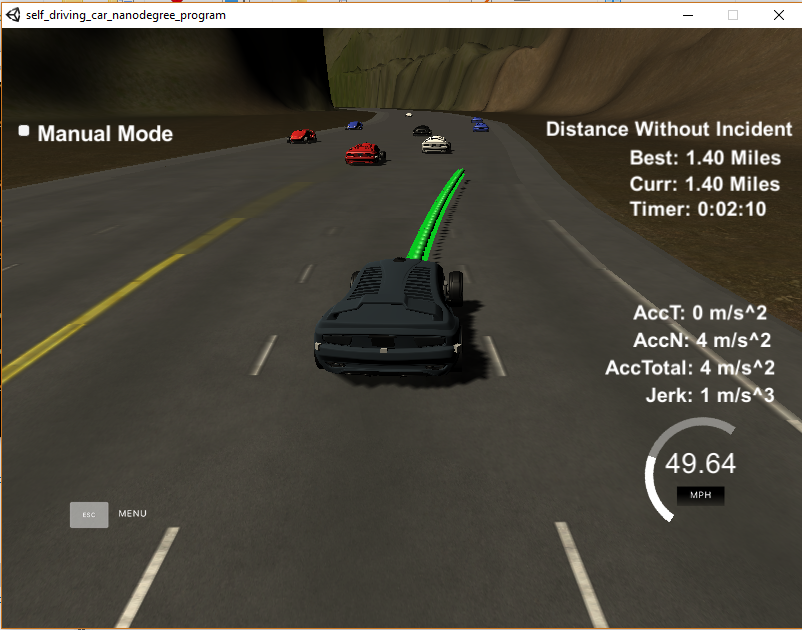

# MPC project

## Overview
This repository contains the work I did within **Project #11 of Udacity's Self-Driving Car Nanodegree Program** (first project of third term). Objective of this project is to build a **path planner** to have a car safely navigate around a virtual highway with other traffic. Implementation is done in **C++**. 

This project uses a simulator provided by Udacity. 

*Snapshot of Udacity's path planning simulator (green curves represents planned trajectory)*

## Repository content

The repository includes the following files:

 - source code in the */src* folder
	 - main.cpp : communicates with the Simulator, receives car and traffic data (see last paragraph for exhaustive description), sends planned trajectory.
	 - vehicle.cpp:  
		 - defines vehicle object
		 - determines possible futur states of the state machine
		 - predicts other vehicle trajectories
		 - determine if other vehicles are susceptible to interfe with ego vehicle
		 - determines maximum velocity that may be achieved for each trajectory
		 - generate raw trajectories
		 - selects the trajectory with minimum cost
	 - cost.cpp: computes the cost associated to a trajectory
	 - helper_functions.cpp: useful functions, for example transformation from cartesian to Frenet coordinates
 	 - json.hpp: JSON is used for communication with simulator
 	 - spline.h: simple cubic spline interpolation library (source [here]())
 	 
 - CMakeLists.txt: file that is used by CMAKE to build the project 
 - /data/highway_map.txt : text file which contains a map list of waypoints around the highway

## Dependencies

* cmake >= 3.5
* make >= 4.1(mac, linux), 3.81(Windows)
* gcc/g++ >= 5.4
* [uWebSockets](https://github.com/uWebSockets/uWebSockets)
* Simulator: it can be download [here](https://github.com/udacity/self-driving-car-sim/releases).

## Basic Build Instructions

1. Clone this repo.
2. Make a build directory: `mkdir build && cd build`
3. Compile: `cmake .. && make`
4. Run it: `./path_planning`

## Project writeup

### Objective
In this project we implement a path planner to safely navigate around a virtual highway with other traffic that is driving +-10 MPH of the 50 MPH speed limit. The simulator provides the car's localization and sensor fusion data (other cars' position and velociy). We are also provided with a text file (./data/highway_map.txt) containing a sparse map list of waypoints around the highway. The goals are the following :
- the car must go as close as possible to the 50 MPH speed limit, which means passing slower traffic when possible (note that other cars may change lanes too),
- the car should avoid hitting other cars at all cost as well as driving inside of the marked road lanes at all times, unless going from one lane to another,
- the car should be able to make one complete loop around the 6946m highway. Since the car is trying to go 50 MPH, it should take a little over 5 minutes to complete 1 loop. 
-  the car should not experience total acceleration over 10 m/s^2 and jerk that is greater than 10 m/s^3.. 

### Simulator input/outputs
#### Highway map
The map of the highway is in data/highway_map.txt. The track contains a total of 181 waypoints, with the last waypoint mapping back around to the first. The waypoints are in the middle of the double-yellow driving line in the center of the highway. Each waypoint has an (x,y) global map position, and a Frenet s value and Frenet d unit normal vector (split up into the x component, and the y component).
The s value is the distance along the direction of the road. The first waypoint has an s value of 0 because it is the starting point. The highway's waypoints loop around so the frenet s value, distance along the road, goes from 0 to 6945.554.
The d vector has a magnitude of 1 and points perpendicular to the road in the direction of the right-hand side of the road. The d vector can be used to calculate lane positions. 
The highway has 6 lanes total - 3 heading in each direction. Each lane is 4 m wide.

#### Data received from the Simulator
- Main car's localization Data (No Noise)
	- ["x"] The car's x position in map coordinates
	- ["y"] The car's y position in map coordinates
	- ["s"] The car's s position in frenet coordinates
	- ["d"] The car's d position in frenet coordinates
	- ["yaw"] The car's yaw angle in the map
	- ["speed"] The car's speed in MPH
- Previous path data given to the Planner, but with processed points removed.
	- ["previous_path_x"] The previous list of x points previously given to the simulator
	- ["previous_path_y"] The previous list of y points previously given to the simulator
- Previous path's end s and d values
	- ["end_path_s"] The previous list's last point's frenet s value
	- ["end_path_d"] The previous list's last point's frenet d value
- Sensor Fusion Data, a list of all other car's attributes on the same side of the road. (No Noise)
	- ["sensor_fusion"] A 2d vector of cars and their data (car's ID, car's x position in map coordinates, car's y position in map coordinates, car's x velocity in m/s, car's y velocity in m/s, car's s position in frenet coordinates, car's d position in frenet coordinates).

#### Data sent to the Simulator
The C++ program must compute and send to the simulator a list of x and y global map coordinates. Each pair of x and y coordinates is a point, and all of the points together form a trajectory. 
Remarks: There is no constraint on the number of points. The only requirement is that the time sampling must be 20 ms, that is every 20 ms the car moves to the next point in the list.
The velocity of the car will then depend on the spacing of the points. Because the car moves to a new waypoint every 20ms, the larger the spacing between points, the faster the car will travel.

### Path planner pipeline

The main.cpp file performs the following steps:
- build vehicles objects from information received from the simulator
- predict other vehicle trajectory
- determine the most appropriate trajectory for ego vehicle
- send to simulator the coordinates of the ego vehicle trajectory 

#### Vehicle object definition
I have defined a `Vehicle` class (in vehicle.cpp) which contains all the characteristics of vehicles and which is used for both ego vehicle and all other vehicles. Upon receiving a message from the simulator, a list of Vehicle objects is built which gathers information from other vehicles (id, position coordinates, speed). An ego vehicle object is also built with the information pertaining to the ego vehicle, which also includes previous path and map data.

#### Other vehicle predictions
The vehicle predictions are done within the function `generate_predictions` of `Vehicle` class. The prediction model is very simple: it takes the current "s" position in Frenet coordinates and propagates it with a first order model using the velocity: `s(n) = s(0)+n*v(0)*T`, where T equals 20 ms. The trajectory is built over 50 points, that is 1 s. The "d" Frenet coordinate is supposed to be constant over the trajectory: `d(n) = d(0)`

#### Ego vehicle planner and trajectory generation
This is the main part of the program. The core function is `def_new_traj`  within `Vehicle` class, but it makes use of several other functions. The  steps of the algorithm are the following (it is largely inspired from the "behavior planner" implementation done in class) :
- define successor states of the state machine
- generate trajectory for each of the state
- compute cost for each trajectory
- returns the lowest cost trajectory

Let's dive into these different steps.

##### State machine
I decided to use a simple state machine with three states: keep lane (KL), lane change right (LCR) and lane change left (LCL). For each of the 3 states, the possible transitions are: remain in the current state or change to one of the other two. There are only two restrictions: it is not possible to remain in LCL (LCR) state if the car is in the left (right) lane. This is required so that the car stays on the highway.
The successor state listing is done within `successor_states` function: it only makes use of ego vehicle lane information.

##### Trajectory generation
This step is done within `generate_trajectory` function.  First step consists in determining the goal lane, according to the selected state.
Second step is to determine the achievable speed in the goal lane. This is done with `get_velocity` function which checks velocity of other vehicles in the goal lane, but only those which are ahead of the car within a predefined range (40m). If a car is present ahead and goes slower, the ego car target speed will be decreased. Deceleration is smooth so as to respect maximum allowed jerk. If no car is present, the car will increase speed so as to reach maximum authorized speed (50 mph).
Final step is to generate a trajectory to reach goal lane. This is done within `gen_raw_traj` function. Objective is to create smooth paths when a lane change is required. The algorithm which is implemented within this function is the same as the one which was presented in the project walkthrough : instead of using quintic polynomials as studied in class, I used the easier implementation presented in the project walkthrough, which consists in using cubic spline interpolation between the current car position and the car's goal destination. The cubic spline interpolation is done thanks to a spline tool which can be found [here](http://kluge.in-chemnitz.de/opensource/spline/). To ensure a smooth transition between previous and new trajectory, we keep a few points from the previous trajectory (at the beginning). I chose to keep 10 points. It was sufficient to ensure continuity while not impeding the car's reactivity.

##### Cost functions
The cost functions are defined to penalize unsafe or uncomfortable trajectories. The following cost functions were implemented (in `cost.cpp`):
- `collision_cost`: ego vehicle trajectory is compared with other vehicle predicted trajectories. If position differences go below 3m, a collision is considered and a cost of 1 is set. This function makes uses of `nearest_approach_to_any_vehicle` function (defined in helper_functions.cpp).

- `buffer_cost`: objective is to penalize lane changes which occur without a minimum margin with respect to other cars. Here I set the margin to +3m (ahead), -5m (behind). Cost is set to 1 if margin is violated, 0 else. This function makes uses of `get_vehicle_alongside`, which is a member function of `Vehicle` class.
- `inefficiency_cost`: objective is to reward high speed. Cost function is a sigmoid function of the reference velocity.

We can set different weights to the cost functions. I decided to put the higher weight on the collision avoidance cost.

### Results
The car turns out to safely drive round the highway. It changes lanes appropriately when approaching slower cars, only if the adjacent lane is empty.
However algorithm is not perfect. I indeed observed two weaknesses:
- in the specific situation where the car is "trapped" between two vehicles which move at the same speed: one ahead and one just aside in the adjacent line (in the middle of the highway). This prevents any lane change and dgo vehicle is stuck in the slow traffic. 
- in the specific situation where a "wall of car" is ahead, whose velocities are almost the same but are fluctuating. Ego vehicle may start a lane change but then revert to "keep lane" if the car ahead's velocity increases a bit. This makes ego vehicle wobbling between the two lanes, and the simulator grades this as an incident. 

It would be necessary to implement more complex algorithms, with memory of the previous situation, to cope with these two cases.

